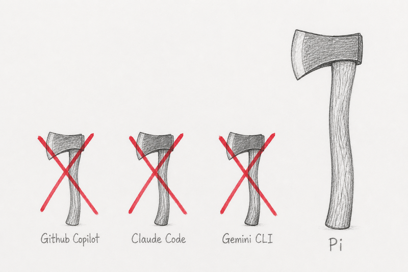

# Pi - One LLM Interface to Rule Them All!

"<a rel="noopener noreferrer" href="https://www.flickr.com/photos/47738026@N05/8476624791">Pi number</a>" by <a rel="noopener noreferrer" href="https://www.flickr.com/photos/47738026@N05">J.Gabás Esteban</a> is licensed under <a rel="noopener noreferrer" href="https://creativecommons.org/licenses/by/2.0/?ref=openverse">CC BY 2.0 </a>.

### Chris Patti - Senior Devops Engineer at MIT Online Learning
---

# Sharpen ONE Ax!

---
# Work With Practically Any Model or Harness

- Anthropic Opus, Sonnet through Claude Code or Github Copilot
- OpenAI GPT X.X via Codex, Github Copilot, etc.
- Local models through Ollama and many more

Choose any model with /model, or hit Ctrl-p to bop between the 2/3 you use a lot!

---
# It's All About The Context (Window!)

If you look at the [Github Copilot CLI System
Prompt](https://github.com/asgeirtj/system_prompts_leaks/blob/main/Misc/copilot-cli.md) you'll
see it's positively massive!

It contains 2978 lines, 56491 words, and 698106 bytes all crammed into your context window
before you even start!

Here's [Pi's default system
prompt](https://github.com/earendil-works/pi/blob/main/packages/coding-agent/src/core/system-prompt.ts#L132) by
comparison!

---
# Pi's Secret Sauce - Self Extension

A trivial example:

**Demo where we watch Pi bolt a Github Issues extension into itself**

---
# Now Let's Integrate With An External Service - Sentry

**Demo where we install Sentry MCP and use it to search for exceptions**
